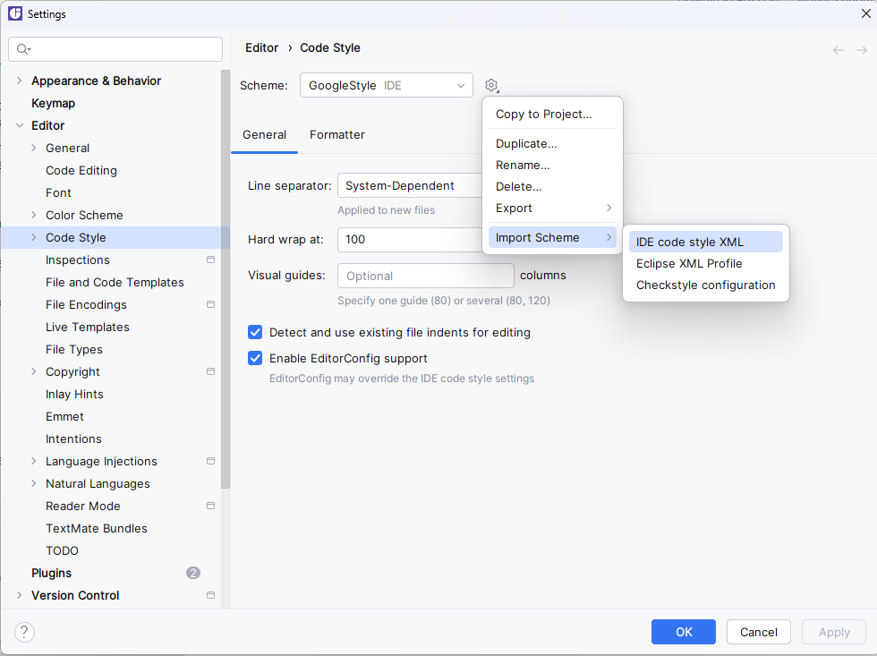

# mentoring-starter

Заготовка проекта, единственная цель которого (пока) - привить навыки работы с Checkstyle.

Checkstyle срабатывает на стадии validate. В случае, если оформление кода не соответствует правилам, то сборка упадёт с ошибкой на этой стадии.
В этом случае есть два варианта действий:
1) Проанализировать ошибку, понять что не так, исправить, перезапустить сборку (повторять, пока не сборка не завершится с успехом)
2) Если имеется уверенность в своей правоте, связаться с ментором. Правила не идеальны и иногда могут давать сбой (очень редко).


**Модифицировать блок `plugins` в `pom.xml` строго запрещено!**

А так, можно как работать в этом проекте и свободно менять всё остальное в pom-нике (предварительно сделав форк или просто скачать репозиторий), так и создать свой, перенеся в него блок с плагинами и файл `relaxed_google_checks.xml`

В проекте лежит класс REMOVEME, написанный с нарушениями код-стайла, его единственное предназначение - продемонстрировать, как выглядят ошибки линтера (.\mvnw validate или запустить validate из меню справа) и быть удаленным😖

Также, в проекте приложен `GoogleStyle.xml`. Это конфигурационный файл code style для IDEA, который должен соответствовать правилам. 

Настроить можно так:

```
Settings -> Editor -> Code Style -> Шестеренка справа от списка -> 
Import Scheme -> IDE code style XML -> Выбрать файл -> Нажать Ок
```


По умолчанию настройки импортируются на уровень IDE, так что переносить от проекта к проекту не придётся.


В теории, при наличии плагина CheckStyle-IDEA, можно импортировать и `relaxed_google_checks.xml`, но в последний раз такая попытка ничем хорошим не закончилась...

P.S. любые конструктивные доработки и предложения приветствуются!
